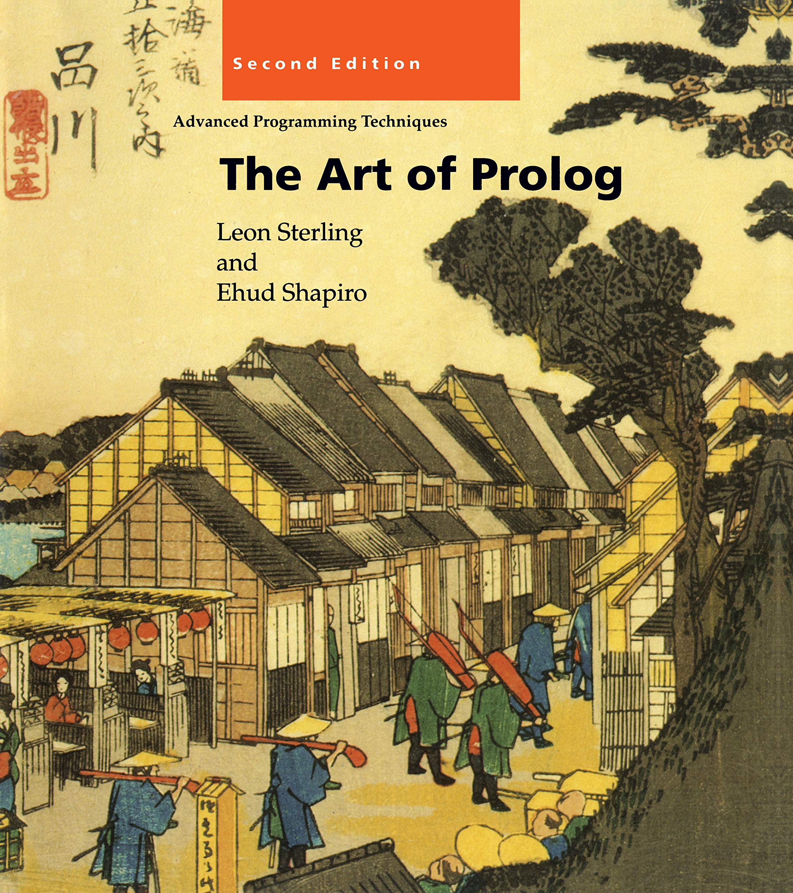

= Playing with Prolog

Just for fun, I am reading

- Leon Sterling, Ehud Shapiro, "The Art of Prolog".

**Prolog** (from french _"programmation en logique"_) is a logical programming language.

In this repo, I will collect some code samples, solutions to exercises, etc.

I am using link:https://www.swi-prolog.org/[SWI Prolog].
In Debian, it is available from the package
https://packages.debian.org/stable/interpreters/swi-prolog:[`swi-prolog`].

There are a couple of plugins for VS Code:
link:https://github.com/arthwang/vsc-prolog[`vsc-prolog`] and
link:https://github.com/rebornix/vscode-prolog[`vscode-prolog`].

== Files

Here's a growing collection of code samples.

- Chapter 1. Basic Constructs

- Chapter 2. Database Programming

- Chapter 3. Recursive Programming

    * link:arithmetic.pl[3.1 Arithmetic]
    * link:lists.pl[3.2 Lists]
    * link:composing.pl[3.3 Composing Recursive Programs]
    * link:trees.pl[3.4 Binary trees]
    * 3.5 Manipulating Symbolic Expressions

- Chapter 4. The Computation Model of Logic Programs

    * 4.1 Unification
    * 4.2 An Abstract Interpreter for Logic Programs

- Chapter 5. Theory of Logic Programs

    * 5.1 Semantics
    * 5.2 Program Correctness
    * 5.3 Complexity
    * 5.4 Search Trees
    * 5.5 Negation in Logic Programming

- Chapter 6. Pure Prolog

    * 6.1 The Execution Model of Prolog
    * 6.2 Comparison to Conventional Programming Languages

- Chapter 7. Programming in Pure Prolog

    * 7.1 Rule Order
    * 7.2 Termination
    * 7.3 Goal Order
    * 7.4 Redundant Solutions
    * 7.5 Recursive Programming in Pure Prolog

- Chapter 8. Arithmetic

    * 8.1 System Predicates for Arithmetic
    * 8.2 Arithmetic Logic Programs Revisited
    * 8.3 Transforming Recursion into Iteration

- Chapter 9. Structure Inspection

    * 9.1 Type Predicates
    * 9.2 Accessing Compound Terms

- Chapter 10. Meta-Logical Predicates

    * 10.1 Meta-Logical Type Predicates
    * 10.2 Comparing Nonground Terms
    * 10.3 Variables as Objects
    * 10.4 The Meta-Variable Facility

- Chapter 11. Cuts and Negation

    * 11.1 Green Cuts: Expressing Determinism
    * 11.2 Tail Recursion Optimization
    * 11.3 Negation
    * 11.4 Red Cuts: Omitting Explicit Conditions
    * 11.5 Default Rules
    * 11.6 Cuts for Efficiency

- Chapter 12. Extra-Logical Predicates

    * 12.1 Input/Output
    * 12.2 Program Access and Manipulation
    * 12.3 Memo-Functions
    * 12.4 Interactive Programs
    * 12.5 Failure-Driven Loops

- Chapter 13. Program Development

    * 13.1 Programming Style and Layout
    * 13.2 Reflections on Program Development
    * 13.3 Systematizing Program Construction

- Chapter 14. Nondeterministic Programming

    * 14.1 Generate-and-Test
    * 14.2 Don't-Care and Don't-Know Nondeterminism
    * 14.3 Artificial Intelligence Classics: ANALOGY, ELIZA, and McSAM

- Chapter 15. Incomplete Data Structures

    * 15.1 Difference-Lists
    * 15.2 Difference-Structures
    * 15.3 Dictionaries
    * 15.4 Queues

- Chapter 16. Second-Order Programming

    * 16.1 All-Solutions Predicates
    * 16.2 Applications of Set Predicates
    * 16.3 Other Second-Order Predicates

- Chapter 17. Interpreters

    * 17.1 Interpreters for Finite State Machines
    * 17.2 Meta-Interpreters
    * 17.3 Enhanced Meta-Interpreters for Debugging 331
    * 17.4 An Explanation Shell for Rule-Based Systems 341

- Chapter 18. Program Transformation

    * 18.1 Unfold/Fold Transformations
    * 18.2 Partial Reduction
    * 18.3 Code Walking

- Chapter 19. Logic Grammars

    * 19.1 Definite Clause Grammars
    * 19.2 A Grammar Interpreter
    * 19.3 Application to Natural Language Understanding

- Chapter 20. Search Techniques

    * 20.1 Searching State-Space Graphs
    * 20.2 Searching Game Trees

- Chapter 21. Game-Playing Programs

    * 21.1 Mastermind
    * 21.2 Nim
    * 21.3 Kalah

- Chapter 22. A Credit Evaluation Expert System

    * 22.1 Developing the System

- Chapter 23. An Equation Solver

    * 23.1 An Overview of Equation Solving
    * 23.2 Factorization
    * 23.3 Isolation
    * 23.4 Polynomial
    * 23.5 Homogenization

- Chapter 24. Compiler

    * 24.1 Overview of the Compiler
    * 24.2 The Parser
    * 24.3 The Code Generator
    * 24.4 The Assembler

---

- link:biblical.pl[Biblical genealogy]
- link:graph.pl[Directed graph]
- link:satisfiability.pl[Satisfiability of boolean formulae]
